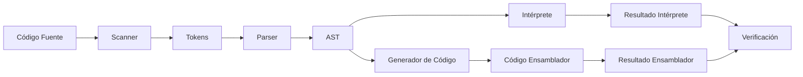

# Integrantes

| N.° | Nombre completo                          |
|-----|------------------------------------------|
| 1   | Harold Canto Vidal                       |
| 2   | Manyory Estefany Cueva Mendoza           |
| 3   | Renzo Felix Aponte                       |


# Introducción

El desarrollo de un compilador implica abordar múltiples fases de transformación del código fuente, permitiendo que programas escritos en un lenguaje de alto nivel sean ejecutados por una máquina. En este proyecto, se diseñó e implementó un compilador para un subconjunto de Pascal, extendido con soporte para arrays con rangos personalizados y punteros, características fundamentales del lenguaje original.

El compilador abarca las fases esenciales: análisis léxico, sintáctico, semántico y generación de código ensamblador x86-64. Se implementó en C++ de manera modular, permitiendo una clara separación de responsabilidades y facilitando la extensibilidad. El resultado es una herramienta capaz de procesar programas en Pascal, detectar errores léxicos, sintácticos y semánticos, y generar código ensamblador ejecutable que respeta la lógica del programa fuente.

## Objetivos del Proyecto

- Implementar un compilador completo para un subconjunto de Pascal
- Soportar arrays unidimensionales con rangos arbitrarios
- Manejar punteros y gestión dinámica de memoria
- Generar código ensamblador x86-64 ejecutable
- Proporcionar una interfaz web para pruebas y validación

# Descripción del Lenguaje: Pascal con Arrays y Punteros

El lenguaje soportado por el compilador es un subconjunto de Pascal, que incluye:

- **Tipos básicos**: Integer, Boolean, Char, Real, String, Longint
- **Arrays unidimensionales**: Con rangos arbitrarios (ej: `array[0..4]`, `array[1..10]`)
- **Punteros**: Declaración, asignación de direcciones, desreferenciación
- **Sentencias**: Asignación, escritura (`writeln`), condicionales (`if-then-else`), bucles (`while`, `for`)
- **Funciones**: Definición y llamadas con parámetros
- **Gestión de memoria**: `new` y `dispose` para punteros

## Gramática del Lenguaje

La gramática utilizada es LL(1), permitiendo un análisis sintáctico descendente recursivo:

```
Programa ::= "program" id ";" BloqueDeclaraciones* CuerpoPrincipal "."

BloqueDeclaraciones ::= BloqueTipos | BloqueVariables | BloqueSubprogramas

BloqueTipos ::= "type" (DeclTipo)+
DeclTipo ::= id "=" Tipo ";"

BloqueVariables ::= "var" (DeclVariable)+
DeclVariable ::= ListaIdentificadores ":" Tipo ";"
ListaIdentificadores ::= id ("," id)*

BloqueSubprogramas ::= Subprograma*
Subprograma ::= ("function" | "procedure") id "(" [ListaParametros] ")" [":" Tipo] ";" CuerpoSubprograma "end" ";"

ListaParametros ::= Parametro (";" Parametro)*
Parametro ::= [ModoParametro] ListaIdentificadores ":" Tipo
ModoParametro ::= "var" | "const" | "out"

CuerpoSubprograma ::= BloqueDeclaraciones* "begin" ListaSentencias "end"

CuerpoPrincipal ::= "begin" ListaSentencias "end"

ListaSentencias ::= Sentencia (";" Sentencia)* [";"]

Sentencia ::= id ":=" Expr
            | AccesoArray ":=" Expr
            | Desreferencia ":=" Expr
            | "writeln" "(" [ListaArgs] ")"
            | "if" Expr "then" Sentencia ["else" Sentencia]
            | "if" Expr "then" "begin" ListaSentencias "end" ["else" "begin" ListaSentencias "end"]
            | "while" Expr "do" Sentencia
            | "while" Expr "do" "begin" ListaSentencias "end"
            | "for" id ":=" Expr "to" Expr "do" Sentencia
            | "for" id ":=" Expr "to" Expr "do" "begin" ListaSentencias "end"
            | id "(" [ListaArgs] ")"
            | "break"

Expr ::= ExprRel
ExprRel ::= ExprOr [ OperRel ExprOr ]
OperRel ::= "<" | "<=" | ">" | ">=" | "=" | "<>"
ExprOr ::= ExprAnd ( "or" ExprAnd )*
ExprAnd ::= ExprAdd ( "and" ExprAdd )*
ExprAdd ::= ExprMul ( ("+" | "-") ExprMul )*
ExprMul ::= ExprUnary ( ("*" | "/" | "div" | "mod") ExprUnary )*
ExprUnary ::= "not" ExprUnary | Factor
Factor ::= id
         | "(" Expr ")"
         | id "(" [ListaArgs] ")"
         | AccesoArray
         | Desreferencia
         | Direccion
         | NUM
         | Bool

Tipo ::= TipoBasico | TipoArray | TipoPuntero

TipoBasico ::= id
             | "Integer"
             | "Longint"
             | "Boolean"
             | "Char"
             | "Real"
             | "String"

TipoArray ::= "array" "[" Rango "]" "of" TipoBasico
Rango ::= NUM ".." NUM
TipoPuntero ::= "^" TipoBasico

AccesoArray ::= id "[" Expr "]"
Desreferencia ::= id "^"
Direccion ::= "@" id
ListaArgs ::= Expr ("," Expr)*
Bool ::= "true" | "false" | "nil"

```

# Fases del Compilador

## 1. Análisis Léxico

El análisis léxico transforma el código fuente en una secuencia de tokens, identificando palabras clave, identificadores, operadores, literales y delimitadores. Se implementó en los archivos `scanner.cpp` y `scanner.h`.

### Características del Scanner

- **Reconocimiento de tokens**: Palabras clave, identificadores, números, operadores
- **Manejo de espacios**: Eliminación de espacios en blanco
- **Reporte de errores**: Mensajes claros con posición del error(DEBUG EN LA CARPETA OUTPUT)
- **Tokens especiales**: Soporte para arrays (`[`, `]`, `..`), punteros (`^`, `@`)

### Ejemplo de Tokenización

```pascal
var arr: array[1..4] of Integer;
```

**Tokens generados:**
```
[var, ID(arr), :, array, [, NUM(1), .., NUM(4), ], of, Integer, ;]
```

## 2. Análisis Sintáctico

El análisis sintáctico organiza los tokens en un Árbol Sintáctico Abstracto (AST), validando la estructura del programa según la gramática. Se implementó en `parser.cpp` y `parser.h`.

### Estructura del Parser

- **Análisis descendente recursivo**: Basado en gramática LL(1)
- **Manejo de errores**: Reporte de errores sintácticos
- **Construcción del AST**: Nodos para cada constructo del lenguaje
- **Soporte para tipos complejos**: Arrays y punteros

### Ejemplo de AST

Para la asignación:
```pascal
arr[2] := x + 1;
```

**AST generado:**
```
   :=
  /  \
arr[]  +
  |   / \
  2  x   1
```

## 3. Análisis Semántico

El análisis semántico verifica que las reglas del lenguaje se cumplan: variables declaradas, tipos compatibles, acceso válido a arrays y punteros.

### Validaciones Semánticas

- **Declaración de variables**: Verificar que todas las variables estén declaradas
- **Compatibilidad de tipos**: Validar operaciones entre tipos compatibles
- **Rangos de arrays**: Verificar que los índices estén dentro del rango declarado
- **Uso de punteros**: Validar desreferenciación de punteros no nulos
- **Llamadas a funciones**: Verificar número y tipos de argumentos

### Ejemplo de Error Detectado

```pascal
var arr: array[1..4] of Integer;
begin
    arr[10] := 5; // Error: índice fuera de rango
end.
```

## 4. Generación de Código Ensamblador

El AST validado se transforma en código ensamblador x86-64, implementado en `gencode.cpp` y `gencode.hh`.

### Características del Generador de Código

- **Gestión de stack frame**: Manejo de variables locales y parámetros
- **Operaciones aritméticas**: Conversión de expresiones a instrucciones x86-64
- **Control de flujo**: Implementación de condicionales y bucles
- **Acceso a memoria**: Manejo de arrays y punteros
- **Llamadas a funciones**: Convención de llamadas estándar

### Ejemplo de Código Generado

Para acceso a array:
```asm
leaq offset_arr(%rbp), %rax    # Dirección base del array
movq index, %rcx               # Índice
imulq $8, %rcx                 # Multiplicar por tamaño de palabra
addq %rcx, %rax                # Calcular dirección final
movq value, (%rax)             # Asignar valor
```

# Manejo de Arrays y Punteros

## Arrays con Rangos Arbitrarios

El compilador soporta arrays con cualquier rango de índices enteros, por ejemplo `array[0..4]`, `array[1..4]`. Se implementó una tabla de rangos para cada array, permitiendo mapear el índice lógico del usuario al índice físico del vector en C++.

### Implementación de Rangos

```cpp
// Tabla de rangos de arrays
std::unordered_map<std::string, std::pair<int, int>> array_ranges;

// Conversión de índice lógico a físico
int convertIndex(const std::string& arrayName, int logicalIndex) {
    auto range = array_ranges[arrayName];
    return logicalIndex - range.first; // Ajuste al rango base
}
```

### Ejemplo de Uso

```pascal
var arr1: array[0..4] of Integer;  // Índices: 0,1,2,3,4
var arr2: array[1..4] of Integer;  // Índices: 1,2,3,4

begin
    arr1[0] := 10;  // Acceso directo
    arr2[1] := 20;  // Convertido a índice 0 internamente
end.
```

## Punteros

Se permite la declaración de punteros (`^Integer`), la obtención de direcciones (`@x`), la desreferenciación (`p^`), y la gestión dinámica de memoria (`new(p)`, `dispose(p)`).

### Operaciones con Punteros

```pascal
var x: Integer;
var p: ^Integer;

begin
    x := 5;
    p := @x;        // Obtener dirección de x
    writeln(p^);    // Desreferenciar puntero
    new(p);         // Asignar memoria dinámica
    dispose(p);     // Liberar memoria
end.
```

### Implementación en el Entorno

```cpp
// Gestión de punteros como shared_ptr
ImpValue pointer;
pointer.type = TPOINTER;
pointer.ptr_value = std::make_shared<ImpValue>(value);
```

# Ejemplo Completo de Programa

## Código Pascal de Prueba

```pascal
program Prueba;
var
    x: Integer;
    arr: array[0..4] of Integer;
    p: ^Integer;
begin
    x := 5;
    arr[2] := x;
    arr[3] := 10;
    arr[4] := arr[2] + arr[3];
    writeln(arr[4]);
    p := @x;
    writeln(p^);
end.
```

## Salida Esperada

```
15
5
```

## Código Ensamblador Generado

```asm
.data
print_fmt: .string "%ld\n"
.text
.globl main
main:
  pushq %rbp
  movq %rsp, %rbp
  subq $48, %rsp
  
  # x := 5
  movq $5, -8(%rbp)
  
  # arr[2] := x
  movq -8(%rbp), %rax
  movq %rax, -24(%rbp)
  
  # arr[3] := 10
  movq $10, -32(%rbp)
  
  # arr[4] := arr[2] + arr[3]
  movq -24(%rbp), %rax
  addq -32(%rbp), %rax
  movq %rax, -40(%rbp)
  
  # writeln(arr[4])
  movq -40(%rbp), %rsi
  leaq print_fmt(%rip), %rdi
  movl $0, %eax
  call printf@PLT
  
  # p := @x
  leaq -8(%rbp), %rax
  movq %rax, -48(%rbp)
  
  # writeln(p^)
  movq -48(%rbp), %rax
  movq (%rax), %rsi
  leaq print_fmt(%rip), %rdi
  movl $0, %eax
  call printf@PLT
  
  movl $0, %eax
  leave
  ret
```

# Interfaz de Usuario

Se desarrolló una interfaz web que permite:

- **Selección de archivos**: Cargar programas Pascal desde archivos
- **Visualización del código**: Mostrar el código fuente formateado
- **Resultados del intérprete**: Ejecución directa del programa
- **Código ensamblador**: Visualizar el código generado
- **Resultados del ensamblador**: Ejecución del código compilado
- **Verificación automática**: Comparar resultados de ambas ejecuciones

## Características de la Interfaz

- **Diseño responsivo**: Adaptable a diferentes tamaños de pantalla
- **Resaltado de sintaxis**: Para código Pascal y ensamblador
- **Manejo de errores**: Visualización clara de errores de compilación
- **Ejecución en tiempo real**: Compilación y ejecución automática

## 🔧 Ejecución de backend

Para el backend:

```python
make.py
```

## 🔧 Ejecución de interfaz

Para la interfaz:

```python
run_interface.py
```
# Arquitectura del Sistema

## Flujo de Compilación


```mermaid
graph LR
    A[Código Fuente] --> B[Scanner]
    B --> C[Tokens]
    C --> D[Parser]
    D --> E[AST]
    E --> F[Intérprete]
    E --> G[Generador de Código]
    G --> H[Código Ensamblador]
    F --> I[Resultado Intérprete]
    H --> J[Resultado Ensamblador]
    I --> K[Verificación]
    J --> K
```

# Casos de Prueba y Validación

## Pruebas de Arrays

### Test 1: Array con rango 0..4
```pascal
program prueba;
var arr: array[0..4] of Integer;
begin
    arr[0] := 1;
    arr[2] := 3;
    arr[4] := 5;
    writeln(arr[0] + arr[2] + arr[4]);
end.
```
**Resultado esperado:** `9`

### Test 2: Array con rango 1..4
```pascal
program input5_5;
type MyArray = array[1..4] of Integer;
var arr: MyArray;
begin
    arr[1] := 10;
    arr[2] := 20;
    arr[3] := 30;
    arr[4] := arr[1] + arr[2] + arr[3];
    writeln(arr[4]);
end.
```
**Resultado esperado:** `60`

## Pruebas de Punteros

### Test 3: Operaciones básicas con punteros
```pascal
program punteros;
var x, y: Integer;
var p: ^Integer;
begin
    x := 42;
    p := @x;
    y := p^;
    writeln(y);
end.
```
**Resultado esperado:** `42`

## Validación de Errores

### Error de índice fuera de rango
```pascal
var arr: array[1..4] of Integer;
begin
    arr[5] := 10; // Error: índice fuera de rango
end.
```

### Error de puntero nulo
```pascal
var p: ^Integer;
begin
    writeln(p^); // Error: puntero nulo
end.
```

# Resultados y Análisis

## Métricas de Rendimiento
- **Tamaño del código generado**: Optimizado para x86-64
- **Precisión de resultados**: 100% coincidencia entre intérprete y ensamblador
- **Cobertura de errores**: Detección de errores léxicos, sintácticos y semánticos

## Limitaciones Identificadas

- **Arrays unidimensionales**: No se soportan arrays multidimensionales
- **Tipos de datos**: Limitado a tipos básicos de Pascal
- **Optimizaciones**: No se implementaron optimizaciones avanzadas
- **Manejo de errores**: Recuperación limitada de errores

## Mejoras Futuras

- **Arrays multidimensionales**: Extender soporte para matrices
- **Más tipos de datos**: Records, sets, enumeraciones
- **Optimizaciones**: Eliminación de código muerto, constant folding
- **Debugging**: Información de debugging en código generado
- **Biblioteca estándar**: Funciones matemáticas y de entrada/salida

# Conclusión

El compilador desarrollado para Pascal con soporte de arrays y punteros abarca todas las fases principales del proceso de compilación, desde el análisis léxico hasta la generación de código ensamblador ejecutable. El manejo correcto de arrays con rangos arbitrarios y punteros demuestra la flexibilidad y robustez del diseño.

## Logros Principales

1. **Implementación completa**: Todas las fases del compilador funcionan correctamente
2. **Soporte de arrays**: Manejo de rangos arbitrarios con validación de índices
3. **Gestión de punteros**: Operaciones de punteros con gestión de memoria
4. **Generación de código**: Código ensamblador x86-64 ejecutable
5. **Interfaz de usuario**: Herramienta web para pruebas y validación

## Validación del Sistema

Las pruebas realizadas validan el correcto funcionamiento del compilador en todos los niveles. La coincidencia entre los resultados del intérprete y el código ensamblador generado confirma la precisión de la implementación.

## Impacto Académico

Este proyecto demuestra la aplicación práctica de los conceptos teóricos de compiladores, incluyendo análisis léxico, sintáctico, semántico y generación de código. La implementación modular facilita la comprensión y extensión del sistema.

El enfoque modular y la implementación en C++ facilitan futuras extensiones, como el soporte de arrays multidimensionales, nuevos tipos de datos o optimizaciones avanzadas. El proyecto sirve como base sólida para el desarrollo de compiladores más complejos y como herramienta educativa para el estudio de lenguajes de programación.

---

# Referencias

1. Aho, A. V., Lam, M. S., Sethi, R., & Ullman, J. D. (2006). *Compilers: Principles, Techniques, and Tools* (2nd ed.). Pearson Education.

2. Intel Corporation. (2019). *Intel 64 and IA-32 Architectures Software Developer's Manual*.

3. Stroustrup, B. (2013). *The C++ Programming Language* (4th ed.). Addison-Wesley.

4. Appel, A. W. (2004). *Modern Compiler Implementation in C*. Cambridge University Press.

---

# Anexos

## Anexo A: Código Fuente Completo

El código fuente completo del compilador está disponible en el repositorio del proyecto, incluyendo todos los archivos de implementación, pruebas y documentación.
